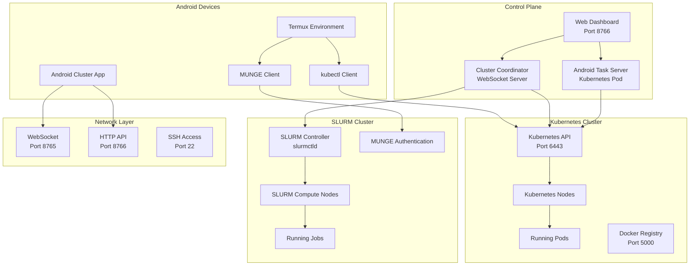
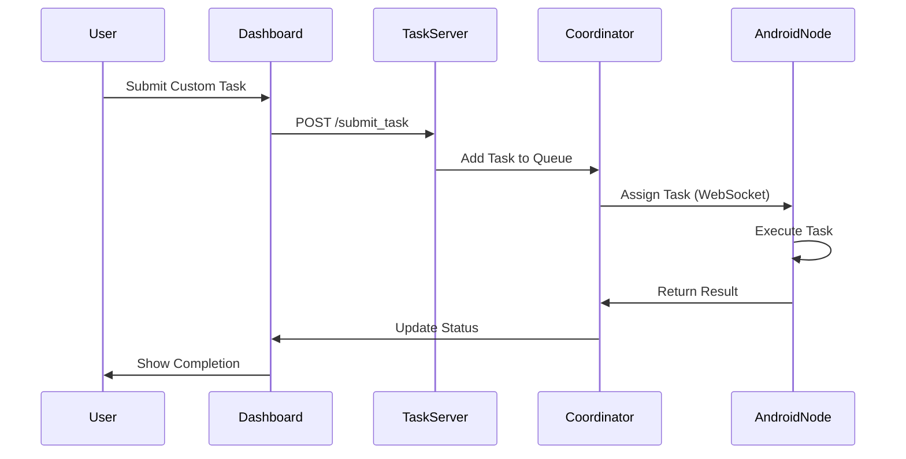
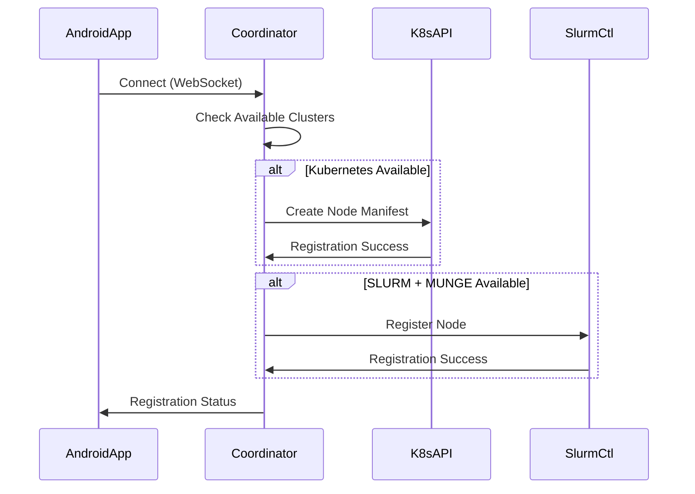

# Android Cluster Architecture

## Overview

The Android Cluster system creates a unified compute environment that seamlessly integrates Android devices with traditional Kubernetes and SLURM clusters, enabling mobile devices to participate as first-class compute nodes.

## Tech Stack Architecture



## Component Details

### 1. Android Cluster App
- **Purpose**: Native Android application for cluster participation
- **Features**:
  - Automatic Termux installation and configuration
  - Real-time task execution and reporting
  - Cluster registration (Kubernetes + SLURM)
  - Performance monitoring and benchmarking

### 2. Cluster Coordinator
- **Purpose**: Central orchestration service
- **Technology**: Python WebSocket server
- **Responsibilities**:
  - Android node registration and management
  - Task queue management and distribution
  - Cluster status monitoring
  - Auto-registration to existing clusters

### 3. Android Task Server (Kubernetes)
- **Purpose**: Kubernetes-native task submission service
- **Deployment**: Kubernetes pod with ConfigMap
- **Features**:
  - REST API for custom task submission
  - Integration with cluster coordinator
  - Scalable and fault-tolerant design

### 4. Web Dashboard
- **Purpose**: Unified monitoring and management interface
- **Features**:
  - Real-time cluster status display
  - Multi-cluster node visualization
  - Custom task submission interface
  - Job/container status monitoring

## Data Flow

### Task Submission Flow


### Node Registration Flow


## Network Architecture

### Port Allocation
- **8765**: WebSocket server for Android connections
- **8766**: HTTP API and web dashboard
- **6443**: Kubernetes API server
- **5000**: Docker registry
- **8000**: JupyterHub (optional)
- **30765**: NodePort for WebSocket (external access)
- **30766**: NodePort for HTTP API (external access)

### Security Model
- **MUNGE Authentication**: Cryptographic authentication for SLURM
- **Kubernetes RBAC**: Role-based access control
- **TLS/SSL**: Encrypted communications
- **Network Policies**: Traffic isolation and security

## Deployment Topology

### Single Node Development
```
┌─────────────────────────────────────┐
│           Control Node              │
│  ┌─────────────────────────────────┐│
│  │     Kubernetes Master          ││
│  │     SLURM Controller           ││
│  │     Android Task Server        ││
│  │     Web Dashboard              ││
│  └─────────────────────────────────┘│
└─────────────────────────────────────┘
           │
           │ WiFi/Network
           │
┌─────────────────────────────────────┐
│        Android Devices             │
│  ┌─────────┐ ┌─────────┐ ┌─────────┐│
│  │ Phone 1 │ │ Tablet  │ │ Phone 2 ││
│  │ (ARM64) │ │ (ARM64) │ │ (ARM64) ││
│  └─────────┘ └─────────┘ └─────────┘│
└─────────────────────────────────────┘
```

### Multi-Node Production
```
┌─────────────────────────────────────┐
│         Control Plane               │
│  ┌─────────────────────────────────┐│
│  │  Kubernetes Master + SLURM     ││
│  │  Android Task Server           ││
│  └─────────────────────────────────┘│
└─────────────────────────────────────┘
           │
    ┌──────┼──────┐
    │      │      │
┌───▼───┐ ┌▼────┐ ┌▼──────────────────┐
│Worker │ │SLURM│ │   Android Farm    │
│ Node  │ │Node │ │ ┌───┐ ┌───┐ ┌───┐ │
│(x86)  │ │(ARM)│ │ │📱 │ │📱 │ │📱 │ │
└───────┘ └─────┘ │ └───┘ └───┘ └───┘ │
                  └───────────────────┘
```

## Integration Points

### Kubernetes Integration
- **Node Registration**: Automatic Android node manifests
- **Pod Scheduling**: Taints and tolerations for Android nodes
- **Resource Management**: CPU, memory, and pod limits
- **Service Discovery**: Kubernetes services for task distribution

### SLURM Integration
- **Authentication**: MUNGE-based secure communication
- **Partition Management**: Dedicated Android partitions
- **Job Scheduling**: Priority-based task allocation
- **Resource Accounting**: CPU hours and memory usage tracking

### Monitoring Integration
- **Metrics Collection**: Node performance and task completion
- **Health Checks**: Automated cluster health monitoring
- **Alerting**: Failure detection and notification
- **Logging**: Centralized log aggregation

## Scalability Considerations

### Horizontal Scaling
- **Android Nodes**: Unlimited device addition
- **Kubernetes Workers**: Standard cluster expansion
- **SLURM Compute**: Traditional HPC scaling

### Performance Optimization
- **Task Batching**: Efficient workload distribution
- **Network Optimization**: Reduced communication overhead
- **Resource Pooling**: Shared compute resources
- **Load Balancing**: Even distribution across nodes

## Technology Stack Summary

| Layer | Technology | Purpose |
|-------|------------|---------|
| **Mobile** | Android + Kotlin | Native device integration |
| **Runtime** | Termux + Linux | POSIX environment on Android |
| **Orchestration** | Kubernetes | Container orchestration |
| **HPC** | SLURM + MUNGE | High-performance computing |
| **Communication** | WebSocket + HTTP | Real-time messaging |
| **Authentication** | MUNGE + RBAC | Security and access control |
| **Monitoring** | Custom Dashboard | Unified cluster management |
| **Storage** | Kubernetes PV | Persistent data storage |
| **Networking** | Flannel CNI | Container networking |

This architecture enables seamless integration of Android devices into traditional compute clusters, creating a hybrid mobile-cloud computing environment with enterprise-grade orchestration and security.
